# DonWells Cue — Operator's Manual

**Version:** 2.6.14
**Source revision:** 8ea1e9c6ee02414301947f210b35b4952aa5d254
**Native engine baseline:** 7a0eee21688e378e99a78b50c0c4ec414435bb65
**Edition:** 6 September 2026 · English · Current-source operator edition

A practical handbook for the person preparing and running audio cues in a live show. Includes same-machine video output, remote control, recovery procedures, and printable checklists.

This edition was prepared and captured from the verified 2.6.14 package at source revision **8ea1e9c**, whose native engine baseline remains **7a0eee2**. It is not a published-release claim: check the installer you will actually use and rehearse it on the performance hardware. Every interface image in this edition is a fresh capture from that package using a disposable practice show and purpose-made test fixtures; engine output was silenced using owned test-gain settings, with the per-image method recorded in **docs/manual-assets/captures.json**. The photographs illustrate physical setup only. No image proves acoustic level, wiring continuity, external-device compatibility, or audience readiness.

## 1. Read this before the show

### What DonWells Cue does

DonWells Cue plays prepared audio cues for theatre, conferences, live events, and installations. A playlist holds the planned sequence. One Shots provide independent quick-play copies for stings and effects. You can prepare trims, fades, loops, and transitions, then use Show Mode for performance.

The desktop app is the controller. A separate audio engine reads the media, runs the cues, and drives the sound device. In normal local operation both run on the same computer. In a network setup the engine runs on the computer connected to the sound system. The sound does not come from the remote controller's browser or speakers merely because it displays the meters.

<!-- diagram:signal-flow -->

The Video Output window is a separate picture renderer on the desktop computer. Its video element is muted; the audio engine remains the source of the soundtrack. A same-machine arrangement is recommended; chapter 9 explains where the picture appears when the audio engine is remote.

### The four operating rules

1. **Confirm the next target before GO.** Read the cue name beside **Play Next** and look for the **Up Next** marker. Selection, an armed target, and a playing cue are different states.
2. **Rehearse what happens at the end.** Imported cues can have **Play Next** end behavior and **Stop All Other Cues** ducking. Do not assume every new cue stops and waits, or that firing a sting leaves a bed running.
3. **Treat Preview as a real output.** Choose a separate headphone or monitor output. Sending Preview to the same physical speakers as Main makes it audible to the audience even though its device ownership is safely shared.
4. **Preserve a known-good show.** Save a rehearsal copy, keep the media with it, and test the exported copy before travel. Autosave is not a versioned backup.

> **CAUTION — Stop is not necessarily instant.** The **Stop All Cues** button and the default **Escape** shortcut use the project's Stop All fade. The default is 1 second; 0 means immediate. Rehearse the configured behavior and know the venue's independent console mute or other emergency-silence procedure.

### Language and terminology

This manual uses the English labels. Change language through **Settings → User Interface → Language** or the desktop **View → Language** menu. That preference belongs to the device, not to the show. The app includes 21 languages and right-to-left layouts for Arabic, Persian, and Urdu.

| Term | Meaning in this manual |
| --- | --- |
| Show / project | The cue document saved natively as a `.dwcue` file, together with its media and related assets. |
| Cue | An audio item, including an item whose media also contains video. |
| Selected | The item you are inspecting or editing; selection alone is not a play command. |
| Up Next | The displayed target for the next GO, chosen automatically or by an explicit Set As Next override. |
| GO | The **Play Next** action; Space is its default shortcut. |
| One Shot | An independent quick-play copy in the One Shots bank. |
| Engine / server | The process that owns audio playback and the active project. |
| Portable archive | A ZIP-based `.dwcuepack` export containing one active show and the files in its dedicated project folder. |
| Legacy import | A `.liveplay` show or `.lpa` archive converted one way into a new canonical `.dwcue` without changing the original source bytes. |

## 2. First setup and a safe first cue

### Install and prepare the computer

Get the installer for your operating system and architecture from the [official releases page](https://github.com/donwellsav/dwcue/releases). Check its release notes against this manual's source edition. Do not update the app, operating system, audio driver, or show files immediately before a performance without rehearsal.

Connect the audio interface before opening the show. Confirm the correct outputs at the sound console, start with a conservative listening level, connect mains power, and disable sleep for the performance using the operating system's controls. Prevent notification sounds from reaching the audience. Keep a separate copy of the show and its media on reliable storage.

On launch, the desktop normally starts its managed local server automatically. The welcome screen indicates **Using local server on this computer** once connected. If the engine is starting, wait for connection rather than repeatedly reopening the app. The **Connect to a server on the network…** option reveals remote setup; see chapter 10 before using it.

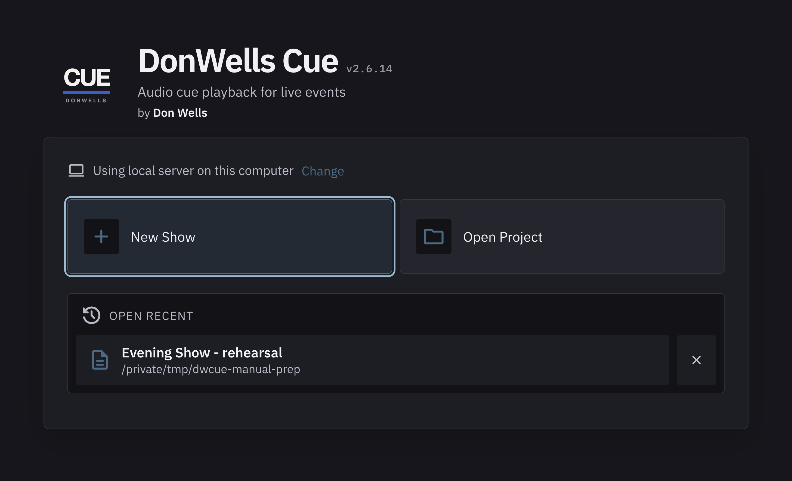

**Procedure — establish a known starting state**

- **Prerequisites:** The intended audio interface is connected, the console channel is muted or at a safe test level, and you know whether this is a local or remote-engine show.
- **Actions:** Launch DonWells Cue once. Wait for the status to settle. Read the connection mode and server identity; do not infer them from which computer holds the mouse.
- **Expected visible outcome:** The welcome screen reports the intended local server, or the remote server you explicitly selected, as connected.
- **Common mistake:** Opening a show while the status is still changing, then treating missing device or media state as a project fault.
- **Recovery:** Wait for a stable connection. If the intended server is wrong, use **Change** and follow chapter 10 before opening any show.

### Create a show

1. On the welcome screen choose **New Show**.
2. Enter a descriptive **Show name**, such as `Evening Show - rehearsal`.
3. Beside **Location**, choose **Choose…**. Location is a read-only summary, not a text field.
4. In the folder picker, navigate to the destination. You may type an absolute path in its path bar and press Enter. Choose **Select folder**.
5. Back in the combined name/location form, check both values and choose **Create Show**.

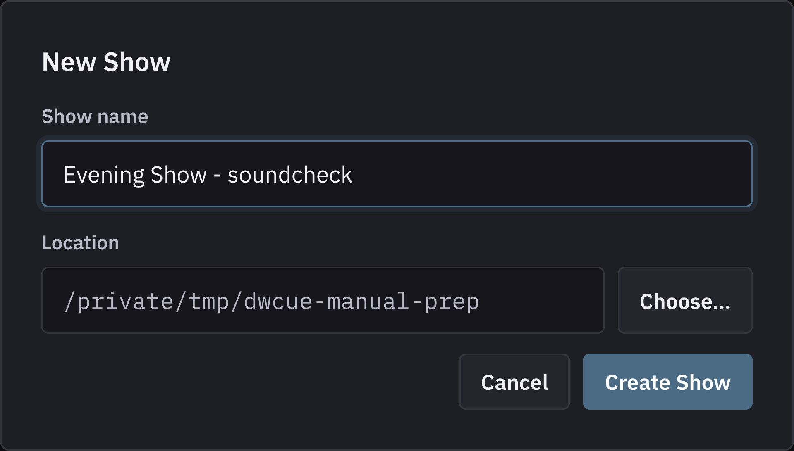

**Expected result:** The workspace opens with the new show name and an empty playlist. **If it does not:** remain on the welcome/dialog state, choose a writable dedicated folder, and create again; do not reuse a folder merely because its name resembles the show.

DonWells Cue creates `<show name>.dwcue` and `media/` in the selected folder; portable exports use `.dwcuepack`. Keep that folder dedicated to the show. A remote picker uses the engine computer. See chapter 11 for legacy import and non-overwrite safeguards.

### Make the first cue deliberately manual

1. Choose **Import Media**, then **Choose files…**, and select a short, familiar audio file.
2. Wait for import and audio readiness; a listed file may not yet be decoder-ready.
3. Open the cue's **Edit** control. In **Basic Info**, set **End Behavior** to **Nothing** for this first exercise. Review **Ducking** before playing other cues alongside it.
4. Open **Settings** and select the intended **Audio Device**. Check the device name at the main output strip. Use the cue's **Output** tab only if it needs a specific output override.
5. Close the properties panel. Check the name beside **Play Next**. If it is not the intended cue, use that row's **Set As Next** control and confirm the displayed target.
6. With the sound system at a safe level, choose **Play Next** once. Confirm the correct active cue, moving time, meters, and actual sound at the intended output.
7. Choose **Stop All Cues**. Observe its fade and verify that all active cues stop.
8. Save through **File**. Reopen during rehearsal and recheck media and device selection.

> **CHECK — Meters are not the whole signal path.** A moving playhead proves transport; a meter proves a signal at that meter. Neither proves the console input, amplifier, loudspeaker, or headphone destination is correct. Listen at the actual destination.

## 3. Find your way around the workspace

### Edit Mode

Use Edit Mode to import, organize, and configure the show. The top bar contains project settings, shortcuts, video output, level checking, Autosave, and the Show Mode switch. Transport sits below it: **Stop All Cues**, the active-cue area, and **Play Next** with its target name. The playlist contains the prepared cue order. The output strip shows the selected device, main level, meters, and true-peak limiter.

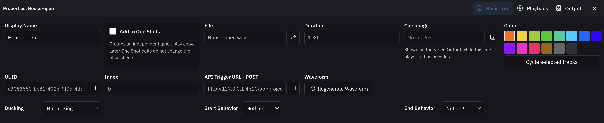

**Procedure — inspect a cue without firing it**

- **Prerequisites:** Edit Mode is active and no text editor or modal covers the playlist.
- **Actions:** Select the cue, choose **Edit**, and read **Basic Info**. Compare its display name and index with the playlist row. Read **End Behavior** before changing it.
- **Expected visible outcome:** Properties names the selected cue while transport independently continues to show the acknowledged **Play Next** target.
- **Common mistake:** Assuming the open Properties panel means this cue is armed.
- **Recovery:** Close or leave Properties unchanged, use **Set As Next** on the intended row, and wait until **Play Next** shows the intended name.

The cue row provides **Set As Next**, **Preview**, **Play**, **Edit**, and **Delete** controls in Edit Mode. Hover for the current tooltip rather than relying on icon shape alone. **Play** fires a cue directly; **Set As Next** requests a manual GO override without playing it. The displayed target changes only after the engine acknowledges the request; a refusal or lost connection leaves the prior target authoritative. The **Edit** control opens **Properties**, with **Basic Info**, **Playback**, and **Output** tabs.

An empty One Shots bank is collapsed by default. Choose **Show One Shots** to reveal it. Assigning a cell can reveal the bank automatically unless you have explicitly chosen its visibility. Collapsing it is a layout decision, not a stop or disarm command.

### Show Mode

Switch to **Show Mode** for performance after preparation is complete. It simplifies the interface and emphasizes transport and large cue controls. It is not an audio lockout: GO, cue triggering, and assigned control inputs remain live. One Shots require arming in Show Mode. Returning to Edit Mode disarms those cells.

Rehearse at the actual display size and app zoom. Keep the next cue name and active-cue controls visible. If a panel or dialog obscures transport, close it before the next call. The **Shortcuts** display is useful during training; check **Customize Shortcuts…** when taking over somebody else's show.

### Selection is not arming

Arrow keys can move selection without starting sound. The selected item's properties may be visible while a different item is Up Next. Use **Set As Next** when you need an explicit GO target. Pressing it again on the manually armed row requests that the override be cleared; an automatic candidate can remain. Wait for the acknowledged target shown on **Play Next** rather than repeatedly clicking to make sure a cue is armed.

Automatic Up Next is enabled by default. Opening a project prepares the first playable item; when a cue with **End Behavior: Nothing** stops, the next sibling is prepared. A natural end at the end of the top-level list can wrap to the first playable item. This prepares a later GO; it does not itself start the next cue. An explicit override takes precedence. Selection alone is not arming.

An accepted GO consumes an explicit override. A rejected command retains it for retry. **Play** and GO remain responsive while a decoder is still becoming ready: the engine either accepts the start when ready or refuses it without inventing playback state. Read the reported readiness/error and connection state before one deliberate retry. **Stop All Cues** and Panic remain available while starts are waiting or refused. Repeated input while the same action is awaiting acknowledgment is suppressed, but a new press after the first action completes is a new command.

## 4. Import and protect the media

### Local files first

Open **Import Media**. In local mode the primary action is **Choose files…**. **Browse Server** and **Advanced options** are collapsed until needed. The server browser remains useful when media is already on the engine computer, including a same-machine setup.

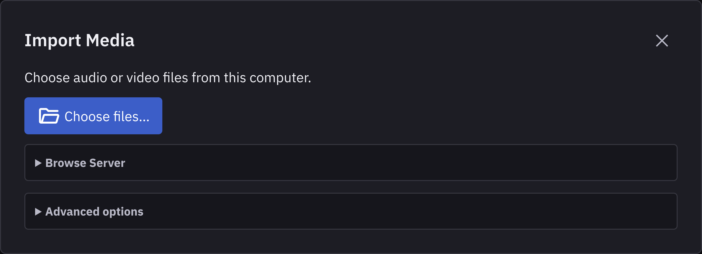

In **Browse Server**, double-click folders to open them. Click files to select; use Shift or Ctrl/Cmd-click for multiple files, then **Import selected**. The file list distinguishes recognizable media, unsupported file types, and files whose type still needs verification. An extension or icon is not proof of decodability; wait for the import result.

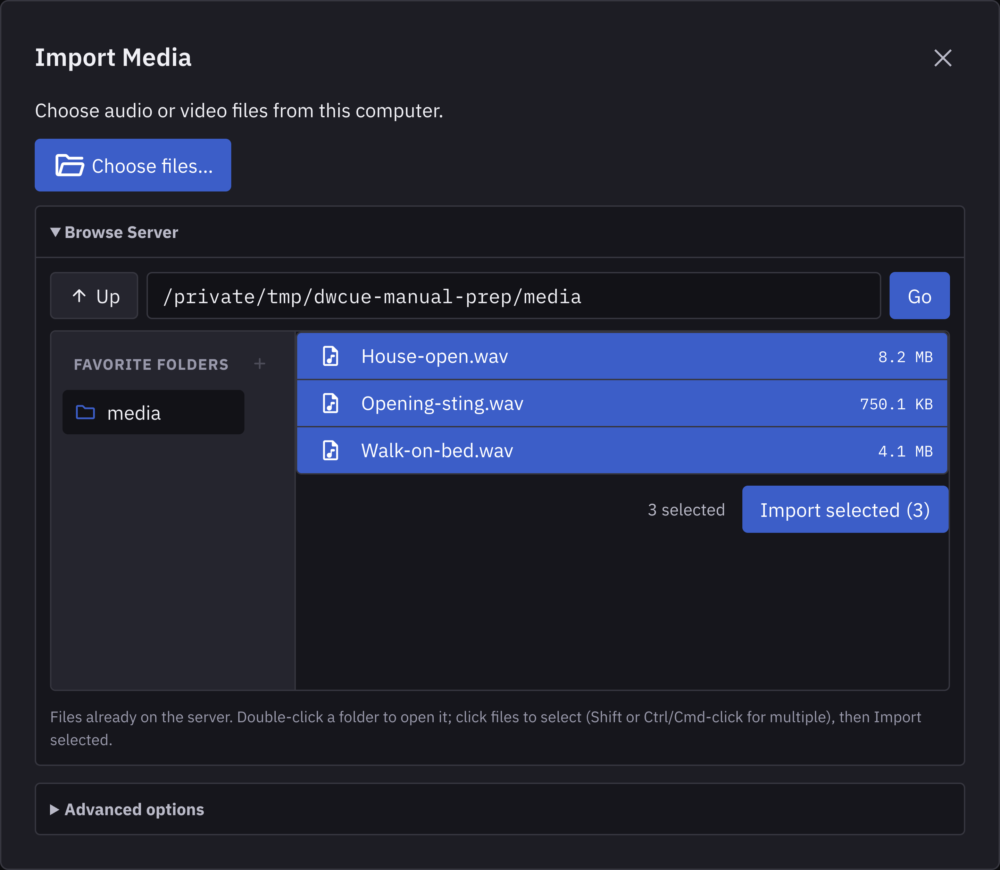

Remote operation separates the two computers: **From This Computer** transfers files from the controller, while **Browse Server** selects files already accessible to the engine. Do not enter a controller-only path into the server browser and expect it to exist remotely.

### Copy or link deliberately

The import dialog starts with **Copy into project media** and **Reuse existing copy** when opened. Check the choices under **Advanced options** if your workflow needs something else.

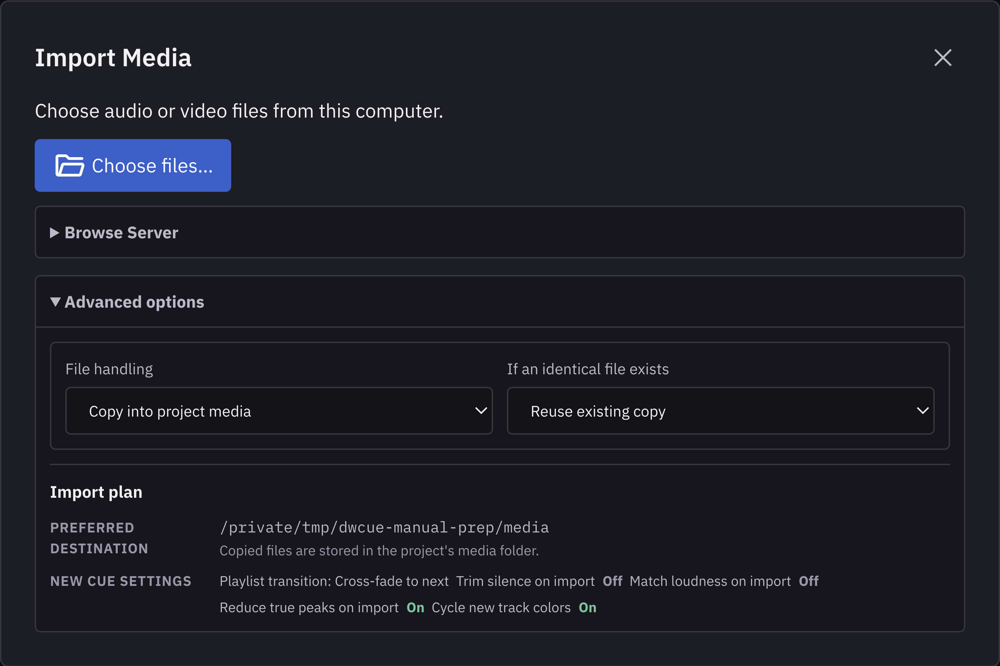

**Procedure — import media that will travel with the show**

- **Prerequisites:** The show is saved in a dedicated folder and the source files are authorized, stable, and available for audition.
- **Actions:** Choose **Import Media → Choose files…**, select the sources, open **Advanced options**, select **Copy into project media**, and choose the intended duplicate policy. Start the import and wait for every result.
- **Expected visible outcome:** Each wanted file reports a successful import and appears as a cue; the project media folder contains the copied source.
- **Common mistake:** Choosing a link to save time, then moving only the `.dwcue` file to another machine.
- **Recovery:** Re-import with copying enabled or replace the cue media, save, export a `.dwcuepack`, and rehearse with the original source volume unavailable.

| Choice | Operational consequence |
| --- | --- |
| Copy into project media | The show has a local media copy in its `media/` folder. Saved paths for copied media are relative to the show folder, making the folder easier to move as a unit. |
| Link in place | The show continues to depend on the original absolute server path. Keep that file and volume available; renaming, moving, unmounting, or losing the source breaks the dependency. |
| Reuse existing copy | Reuse an identical existing file in project media instead of creating another copy. Matching is based on file content, not just its name. |
| Skip it | Omit an import whose content matches an existing project-media file. |
| Keep another copy | Import another copy using a unique filename rather than overwriting the existing file. |

For a travelling show, prefer copying media and test the export on the destination machine. A `.dwcue` file alone is not an audio package. Do not assume an archive has collected every externally linked file; verify the imported result with the original sources unavailable.

### Import processing and readiness

Project/import settings include automatic loudness matching, true-peak reduction, and silence trimming. The new-project defaults in this source enable true-peak reduction, while loudness matching and silence trimming are off. Review the active project's settings rather than assuming another operator left the defaults unchanged.

Processing can change the resulting media or its playback level. Keep the original files outside the working copy if you may need to undo preparation decisions. Listen to entrances, tails, and intentional silence after trimming or processing. Check that music, dialogue, and effects have sensible relative levels; matching a numeric loudness target does not make every cue equally appropriate for the room.

Do not start the show while media is still being verified or decoded. Resolve failed or missing files, then audition the cue. Regenerating a waveform updates its display; it is not a substitute for a successful decoder load or a listening check.

### Online imports

YouTube and Spotify import controls are available in Edit Mode. They depend on external services and downloader availability. Prepare and verify these imports before the show, not on a live cue call. Use only material you are authorized to obtain and perform; an import feature does not supply a public-performance licence. Once imported, rehearse from the local show media rather than relying on a working internet connection at the venue.

## 5. Build cues and transitions

### Name, inspect, and arrange

Use descriptive **Display Name** values that match the show caller's language. Color can group related material, but do not make color the only cue identifier. The internal **UUID** identifies the cue; **Index** reflects its place in the current hierarchy and can change when you reorder. When assigning a **Go to Index** target, use the index shown by the app, not a printed cue number from another system.

Drag cues into the required order and use **Add Group** where a folder-like structure makes the show easier to navigate. Save and rehearse after rearranging any sequence with jumps, groups, or automatic transitions. A correct-looking playlist does not prove that every transition points where you intend.

Replacing a cue's file keeps its cue identity but reloads the corresponding media decoder. Recheck duration, trims, fades, waveform, level, and end behavior after replacement; an old trim can be inappropriate for the new file. Do media replacements during preparation, not during a live cue.

### Trims, fades, and normalization

Open **Properties → Playback** for the waveform and timing controls. Set **In Point** and **Out Point** around the part you want to use. Listen to the entrance and exit; a visually quiet waveform may contain room tone, a breath, or an intentional pause. Leave enough material for any fade or transition you configure.

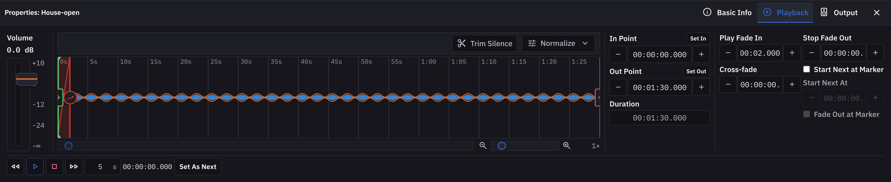

**Procedure — trim and rehearse one cue**

- **Prerequisites:** Use a rehearsal copy, a safe listening level, and the same media file planned for performance.
- **Actions:** Open **Playback**, set In and Out, set the required fades, save the trim, then play from before the entrance through the exit. Repeat through any Start Next marker or cross-fade.
- **Expected visible outcome:** The playhead begins and ends at the authored region; any following cue starts only by the selected end/marker rule.
- **Common mistake:** Judging the waveform visually and skipping the last seconds of the audition.
- **Recovery:** Stop, widen the region, remove the automatic transition if its target is uncertain, and rehearse again.

| Control or concept | Use it for |
| --- | --- |
| In Point / Out Point | Choosing the playback region without treating a waveform view as a destructive audio editor. |
| Play Fade In | The cue's fade-in at the start of playback. |
| Stop Fade Out | The authored fade at the end of the cue's playback region; it also contributes to manual-stop timing. |
| Cross-fade | Starting the following cue before the current cue ends, for overlap. Rehearse with both cues' ducking and fades. |
| Start Next at Marker | Starting the next cue at a chosen waveform marker instead of relying on the ordinary end point. |
| Fade Out at Marker | Fading the current cue as the Start Next marker transition occurs. |

**Start Next at Marker** takes precedence over ordinary cross-fade timing. Loop suppresses automatic next, Start Next, and cross-fade until its live behavior is changed. Manual Stop uses the greater of Stop Fade Out and the cue's legacy fade-out duration, which is 1 second on a new cue even when the visible Stop Fade Out is 0. Fade Out at Marker uses that legacy duration. Stop All uses its separate global fade. Rehearse these paths separately rather than assuming a zero visible fade makes every stop instantaneous.

The waveform's **Normalize** control offers **Loudness (LUFS)** and **True peak (dBTP)**. It writes an absolute cue **Volume** value, not a rewritten media file, and can set Volume as high as +10 dB. The true-peak target cannot exceed the active limiter ceiling. After normalizing, inspect Volume and audition at a safe output level; normalization can make a cue substantially louder.

### Choose the end behavior deliberately

**Properties → Basic Info → End Behavior** is the main supported way to control what follows a cue.

<!-- diagram:cue-lifecycle -->

The group cue-lifecycle chart distinguishes Audio Start actions, descendant playback, natural completion with Audio End actions, and cancellation by manual stop. It is a decision aid, not a timing trace: a real decoder, network, fade, or device can still refuse or delay a transition.

| End Behavior | Result to rehearse |
| --- | --- |
| Nothing | End the cue without automatically starting a following item. Use for manually called, stop-and-wait cues. |
| Play Next | At audio end, start the resolved next target; this can honor the acknowledged **Up Next** target, otherwise it follows the structural next sibling in the same immediate container. Confirm the displayed target before playback reaches the end. |
| Go to Item | Start the specifically selected cue when this cue ends. |
| Go to Index | Start the item at the configured index; recheck after changing the hierarchy. |
| Loop | Repeat the cue's playback region until the operator changes the live course of playback. |

**Procedure — make a cue stop and wait**

- **Prerequisites:** Select the intended cue in Edit Mode and confirm no current playback depends on an automatic transition from it.
- **Actions:** Open **Properties → Basic Info**, set **End Behavior** to **Nothing**, save if Autosave is off, and rehearse the cue through its natural end.
- **Expected visible outcome:** **Nothing** remains selected and the cue ends without automatically starting another item; a later **Play Next** target may still be prepared for a deliberate GO.
- **Common mistake:** Reading **Up Next** as proof that the next cue will start automatically.
- **Recovery:** Stop unexpected playback safely, return the ending to **Nothing**, inspect Audio Start Behavior and marker actions for other automatic starts, and rehearse again.

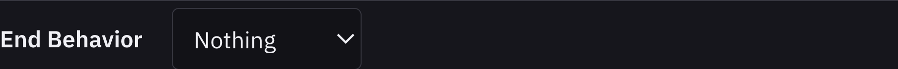

Do not use a loop as a substitute for rehearsing the loop boundary. Check for clicks, a level change, or a gap at the join on the actual output hardware. See chapter 7 for **Cue to Continue**, which releases the current pass without rewriting the saved Loop setting.

**Audio Start Behavior** is authored separately from End Behavior. Its Play Next, Play Item, and Play Index choices run when that cue starts; **Start Next at Marker** remains a separate timed playback action. These starts can create overlapping or structural playback, so rehearse the target, ducking, loop, and cycle-fence behavior rather than assuming the cue only affects what happens at its end.

### Groups

A group's **Start Behavior** can be **Play First** or **Play All**. Play First triggers its first playable descendant. Play All owns the selected descendant subtree and starts each selected playable descendant exactly once, including nested groups. For Play All, set each child's ducking so the children do not immediately stop one another when simultaneous playback is intended.

**Procedure — validate a group before it reaches the run sheet**

- **Prerequisites:** All intended descendants are imported, named, and individually playable.
- **Actions:** Select the group, set **Start Behavior**, inspect every selected child's ducking and ending, and set the group's own End Behavior. Arm the group and fire it once in rehearsal.
- **Expected visible outcome:** **Play First** starts one first playable descendant; **Play All** starts the complete selected subtree only after preflight succeeds. The group ending runs once after normal completion.
- **Common mistake:** Giving children **Stop All Other Cues** inside a Play All group.
- **Recovery:** Stop the run, correct child ducking, return the group ending to **Nothing** until its exit is certain, and repeat the complete rehearsal.

A group's GO is acknowledged only after the engine has preflighted the actual selected subtree. If any required descendant cannot start, the group is refused without partially starting its other children and stays armed for retry. Once accepted, the group owns that run through nested transitions, manual stops, and cancellation; verify the expected active descendants after GO.

A child's **Play Next** advances within its immediate group. When an owned group run completes, the group's configured End Behavior is applied exactly once. Use the group ending or an explicit Go to Item/Index target to leave the group, and rehearse nested groups so only the intended transition crosses the boundary.

Manual stop or cancellation ends the owned group run without allowing stale child completions to fire its ending later. **Nothing** remains the safe default when the group must stop and wait.

### Beds, stings, and ducking

The **Ducking** choices are **Stop All Other Cues**, **No Ducking**, and **Duck Others**, with a **Duck Level**. Decide what a cue should do to sound that is already running before you fire it.

<!-- diagram:duck-envelope -->

The duck-envelope chart is **schematic, not measured**. It shows authored attack, the strongest active absolute ceiling during overlapping duck owners, and authored release toward recomputed base gain. It does not predict loudness, console dynamics, or the exact curve on any hardware.

- For a sting that must leave a music bed running unchanged, choose **No Ducking** and rehearse both levels together.
- **Duck Others** temporarily sets each other active cue's gain to the absolute Duck Level, then restores its prior gain. It is not a relative reduction: a cue already quieter than that target can become louder. Choose and rehearse the target against every cue that may be running, including the restoration when ducking ends.
- **Stop All Other Cues** is intentionally disruptive. It is appropriate when replacing existing playback, not when adding a layer that must coexist.

## 6. Audio outputs, Preview, levels, and timecode

### Establish the main output

Open **Settings** and choose **Audio Device** for the show. Check the device name in the main output strip and listen at the sound system. Hardware names and availability can change when a device is unplugged, a driver changes, or the show moves to another computer.

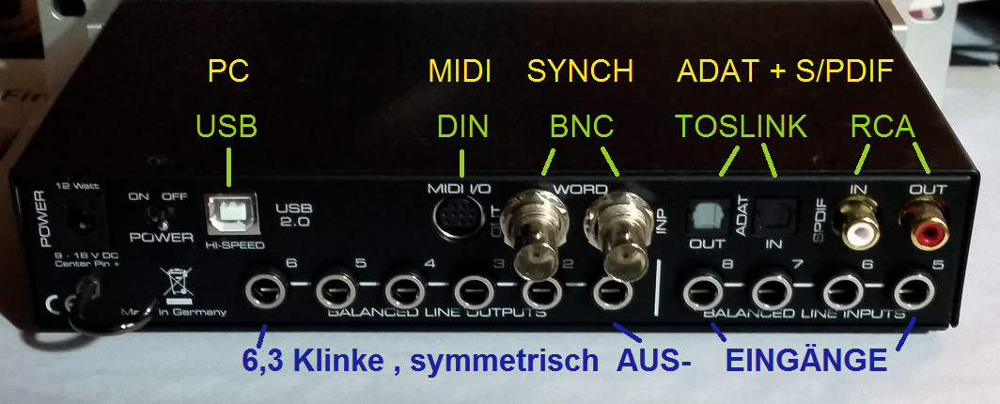

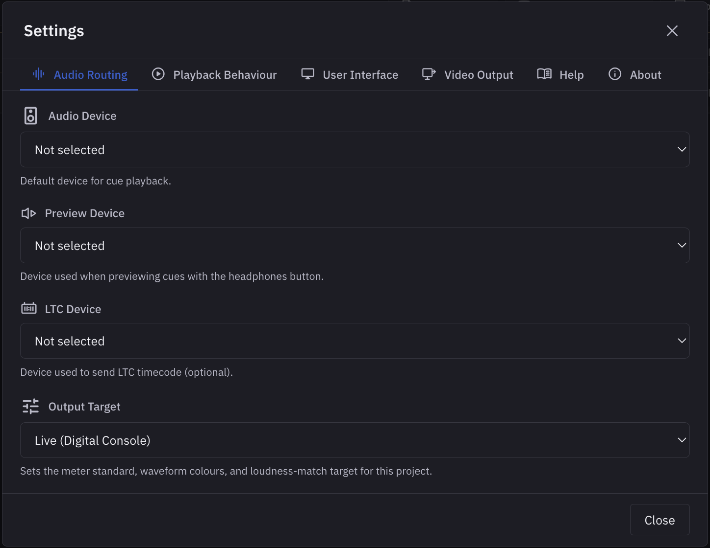

**Procedure — prove the Main route end to end**

- **Prerequisites:** The console operator is present, audience feeds are protected, cables are labelled, and a known low-level test cue is available.
- **Actions:** Open **Settings → Audio Routing**, select **Audio Device**, save, and confirm the same device in the workspace output strip. Play the known cue at a conservative level while the console operator identifies the arriving channel and destination.
- **Expected visible outcome:** Transport and the intended output meter move, and the console operator confirms the expected physical input and listening destination.
- **Common mistake:** Stopping after seeing an application meter.
- **Recovery:** Stop audio. Trace cue override, project device, application output, interface channel, cable, console patch, mute, and destination in that order.

A cue may specify a different **Properties → Output → Output device**. An explicit cue override can explain why one cue is silent on the expected Main output while other cues work. Audit overrides when preparing the backup machine, rather than assuming the project's main selection overrides every cue.

The engine supports more advanced routing through its API, but the current desktop app does not mount a routing-matrix editor. The current operator-visible routing detail is the project device selection and a cue's **Properties → Output** override.

### Configure Preview before using headphones

1. Connect and identify the intended headphone or monitor device.
2. Open **Settings → Preview Device** and select it.
3. At a safe level, use a cue's **Preview** control and verify that it is heard only where intended.
4. Stop the preview before returning to show operation.

If Preview is not configured, its cue-row control opens Project Settings rather than silently choosing a destination. Preview is separate from the live cue transport and does not drive Video Output. Changing the Preview device no longer closes a hardware device still owned by Main, but sharing a physical output still makes both signals audible there.

> **CAUTION — No automatic audience isolation.** The word Preview does not make the output private. Use an actually separate device/output and test it with the console operator. Do not audition an unknown cue through Main during a performance.

### Gain, metering, and the limiter

<!-- diagram:gain-stages -->

The gain-stages chart separates cue gain, ducking, the engine/MIDI internal global-gain stage, the existing downstream output faders/trims, the device stream, and the Preview monitor route. **Preview is also affected by the internal global-gain stage.** That internal stage has no separate UI control or readout; the visible main **Master** fader remains an output control. The chart is a logical map, not a calibrated measurement of the interface, console, amplifier, or room; limiter behavior is described below.

Balance cues at their own level controls first, then use the main output level for the overall show. Leave practical headroom for overlapping cues. A large positive gain setting can make a quiet source unexpectedly loud; changing the output target is not a replacement for a listening check.

The selected output target influences meter presentation, loudness targets, and limiter ceiling. The Live target uses a true-peak ceiling of approximately **−0.1 dBTP** by default. The **TP Limiter** control shows gain reduction; the ceiling can be adjusted. Keep the limiter enabled unless you have a specific, rehearsed reason not to.

A limiter reduces digital peaks; it does not protect against an inappropriate acoustic level, a badly balanced cue, a wrong output patch, or downstream console gain. Persistent large gain reduction is a reason to lower and rebalance the source, not to raise the ceiling until the warning disappears. Use **Level Check** during preparation and resolve problems before switching to Show Mode.

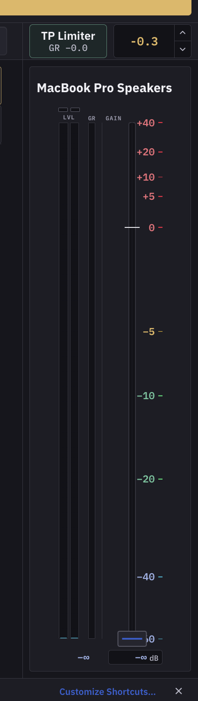

**Procedure — set a repeatable operating level**

- **Prerequisites:** Main routing is proved end to end and the console gain structure is agreed.
- **Actions:** Return individual cue gains to reviewed values, set the visible main **Master** output fader to the agreed reference, and set other output faders only when their routes require it. Play representative single and overlapping passages while watching meters and limiter reduction and listening at the destination.
- **Expected visible outcome:** The main Master output fader changes that output pair while the other output faders retain their own values; peaks retain headroom without sustained limiter reduction.
- **Common mistake:** Assuming MIDI Master Volume will move the visible output fader, or using the main fader to hide one badly balanced cue.
- **Recovery:** Stop or lower safely, restore the documented output-fader references, rebalance the cue itself, and repeat single plus overlap checks.

### Output LTC timecode

LTC is an audio-encoded synchronization signal for other equipment. It can be loud and unpleasant if routed to audience speakers. Set **Settings → LTC Device**, then enable **Properties → Output → Output LTC Timecode** only on cues that require it. Select the frame rate and start timecode to match the receiving system.

The engine supports 24, 25, 29.97 non-drop, 29.97 drop-frame, and 30 frames per second. The receiving device must use the same convention; drop-frame and non-drop are not interchangeable labels. Confirm lock and the starting timecode with the receiving operator during rehearsal, including what happens on stop, seek, replay, and a loop.

Keep the LTC destination separate from the audience audio path. Do not enable timecode on a cue merely because the checkbox is available. Record the device assignment and frame rate on the show handover sheet.

## 7. Run the show

### A repeatable GO procedure

1. Confirm the correct show and a connected, ready engine.
2. Read the caller's cue and find the intended item.
3. Read the name beside **Play Next** and check **Up Next** in the list. Use **Set As Next** if you need to override the automatic candidate; do not toggle an already correct manual target off.
4. On the cue call, press **Play Next** or its assigned shortcut once.
5. Confirm the expected active cue and progress, then prepare the next target.

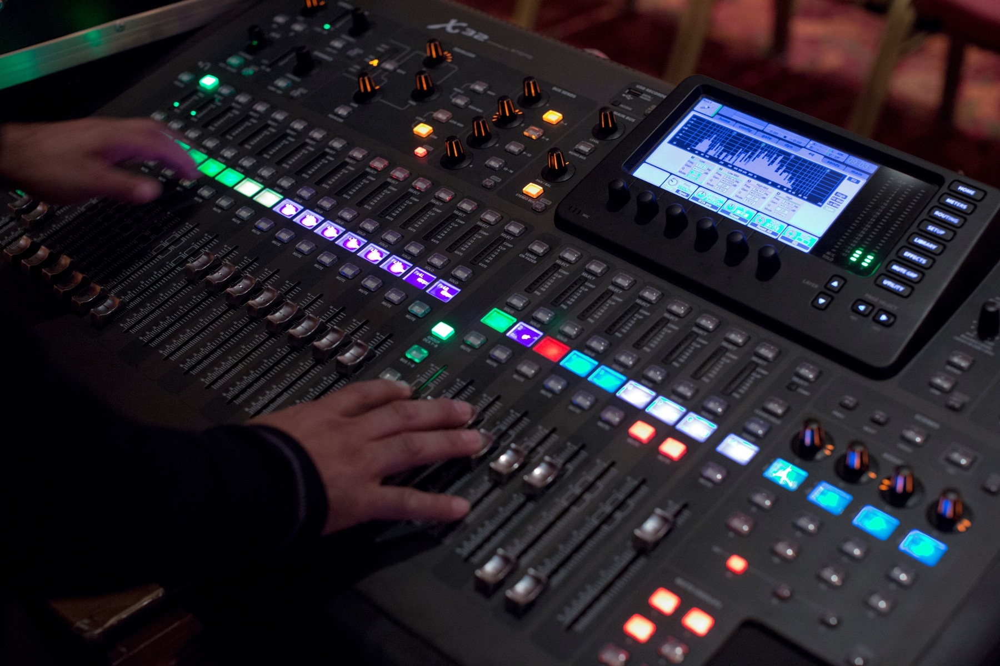

**Procedure — call and confirm one GO**

- **Prerequisites:** Correct show, engine, output, stop policy, and next target have been checked; hands are clear of unrelated controls.
- **Actions:** Read the cue call, read the name beside **Play Next**, press GO once, and move your eyes to the active-cue area. Confirm the intended name and advancing time before preparing the following target.
- **Expected visible outcome:** The accepted cue becomes active and the next acknowledged target is displayed separately.
- **Common mistake:** Double-pressing because the first request takes time to acknowledge.
- **Recovery:** Do not press again blindly. Read active state and any refusal; use the rehearsed Stop All/console response if wrong material is active, otherwise resolve the refusal and make one deliberate retry.

The default GO key is **Space**. **Enter** is Play Selected, a separate action. Check the project's shortcut assignments before operating; do not transfer keyboard habits from another show without checking them. A click is only a request until the engine acknowledges it. Decoder preparation does not freeze GO: an unready start is refused visibly, the armed target is retained, and Stop All/Panic remain live. Resolve the reported cause, then retry once.

### Active-cue controls

The active-cue area provides per-cue controls as appropriate. Pause/Resume holds and resumes playback. Stop ends the cue with its configured stop behavior. A row's live controls can also stop or restart that cue. Restarting is a fresh playback instance, not a continuation of a previously armed one-pass action.

**Stop All Cues** affects all current live cues, not just the selected row. It is available by button and by the assigned shortcut. With the default project settings the fade is 1 second. Set and rehearse a 0-second Stop All fade only if immediate silence is the required operating policy.

### Finish a loop without changing the saved show

Use **Cue to Continue** on an active looping cue when the current loop pass should finish and then advance. The cue must be authored to Loop. The action belongs to this playback instance: it disables repeating for this pass and resolves the continuation from a saved item/index destination or the next sibling. If no valid target exists, the current pass finishes without starting another cue. The saved End Behavior remains Loop.

Stopping, replaying, removing the cue, replacing its media, using Stop All, or switching projects cancels that one-pass continuation. A later replay uses the authored behavior again. By contrast, the separately assignable keyboard/MIDI **Toggle Loop** action sets **End Behavior** to **Loop** when it was not Loop, otherwise to **Nothing**; it does not restore the previous ending. This is a project edit, autosaved while Autosave is enabled and otherwise left dirty until you save. Use Cue to Continue when you intend only a one-pass release without changing the authored show.

**Jump Cue** stops the current cue and advances immediately rather than waiting for the loop end. Rehearse the exact jump target and audible transition before using it live. Neither Cue to Continue nor Jump Cue has a default keyboard binding; use its visible active-cue control or assign a deliberate shortcut.

### When the expected cue does not start

A failed GO preserves the armed target. It may be waiting for media, unable to decode, disconnected, or pointing at an unavailable item. Read the refusal and resolve the cause before one deliberate retry. Do not assume that selecting a different row or clicking **Set As Next** has changed the armed target; wait for the acknowledged name shown beside Play Next.

For group playback, a refused Play All preflight starts none of the selected descendants; inspect readiness across the selected subtree before retrying. For overlapping playback, verify the new cue's Ducking mode. If the wrong material is audible, follow the rehearsed stop or console-mute procedure first, then investigate without repeatedly firing additional cues.

### At the interval and at the end

Stop or intentionally leave only the required interval material running. Disarm unnecessary One Shots, verify the next target for the restart, and avoid editing device assignments while audio is live. After the final cue, confirm that all active cues and previews have stopped. Save any intended changes, make the required backup, and choose the appropriate client/server quit action in chapter 11.

## 8. One Shots, keyboard control, and MIDI

### Prepare independent quick-play cues

Reveal **One Shots**, then use an empty cell's **Import One Shot** action, drop a local audio file into it, or use **Add to One Shots** from a playlist cue's Basic Info. Adding an existing cue creates an independent copy with a new identity. Later edits to the One Shot do not change the playlist source, and later playlist edits do not automatically update the One Shot.

Open a tile's settings and review these choices before assigning its control key:

| Setting | Operator decision |
| --- | --- |
| Playback: Overlay | Mix with the program without ducking it. |
| Playback: Duck Program | Temporarily set other active cues to the absolute Program Level, then restore their prior gains. A quieter cue can be raised; rehearse the actual result. |
| Playback: Replace Program | Stop the other program cues when firing this One Shot. |
| When triggered again: Restart | A later accepted trigger starts the One Shot again. |
| When triggered again: Ignore | Ignore further triggers while it is already active. |
| Ending: Stop / Loop | Finish once or repeat; prepare a stop plan for every loop. |
| Auto-disarm after fire | Require a new arm after a successful fire; enabled by default. |
| Output | Use the project default or a deliberately selected separate device. |

New One Shots start with Ending Stop, retrigger Restart, and Duck Program behavior at approximately −20 dB program level. Check imported or copied settings rather than assuming every cell matches that initial configuration. **Duck Time** and **Release Time** author the runtime attack and recovery. Overlapping duck owners use the strongest absolute Program Level, and restoration follows the surviving owners before returning each cue to its recomputed base gain. Rehearse the actual envelope and the case where one overlapping One Shot ends before another.

### Arm, fire, and stop

In **Show Mode**, use **Arm** and verify **ARMED** before firing a tile, its keyboard shortcut, or its MIDI mapping. Unarmed activation is ignored. A successful fire auto-disarms when that setting is enabled; a failed fire does not. The Stop control remains available regardless of arming.

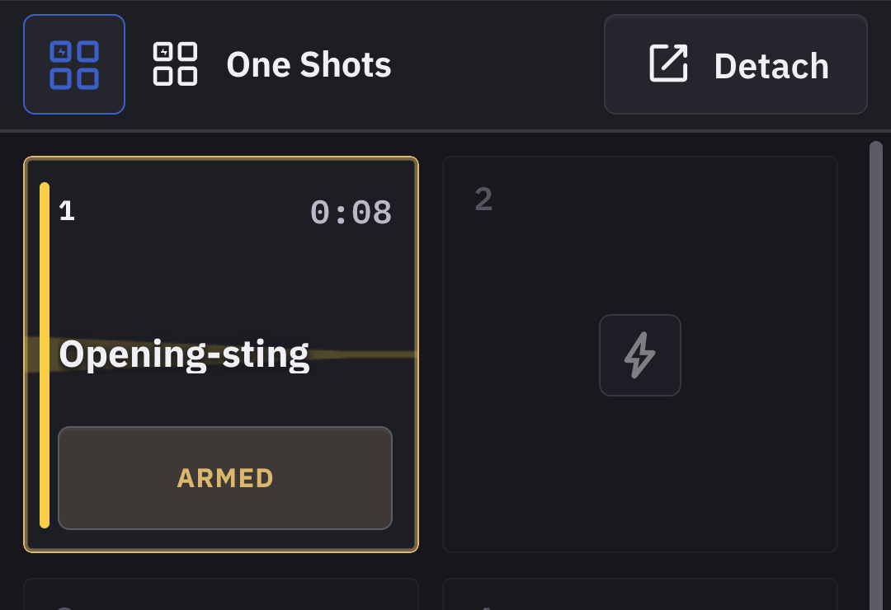

**Procedure — prepare one Show Mode One Shot**

- **Prerequisites:** Its audio, output, Overlay/Duck/Replace policy, retrigger, ending, and stop plan were rehearsed.
- **Actions:** Enter Show Mode, choose **Arm** on only the required tile, read **ARMED**, trigger it once by the intended control, and observe whether auto-disarm occurs.
- **Expected visible outcome:** An accepted trigger starts the named One Shot; the tile disarms after fire only when configured to do so.
- **Common mistake:** Testing in Edit Mode and assuming Show Mode will not require arming.
- **Recovery:** Use the tile's Stop control regardless of arm state, correct the settings in Edit Mode, return to Show Mode, and arm again.

**Edit Mode is not arm-protected.** Its Play control can fire a One Shot without arming. Leaving Show Mode disarms every cell, so check the bank again after returning to Show Mode. Collapsing the bank is not an emergency stop, and hiding it does not make assigned keys safe to press.

The bank can **Detach** into a separate window and **Attach** again. Rehearse focus and screen placement on the actual machine. Removing a cell's One Shot designation does not delete its source media. Do not treat a hidden, detached, or removed tile as proof that audio has stopped; check active playback.

### Assign and verify keyboard shortcuts

Open **Shortcuts → Customize Shortcuts…** and use the **Keyboard** tab. Select a playback action or configured One Shot and press the desired key. The app reports reserved combinations or conflicts; resolve those deliberately rather than creating ambiguous show controls. Individual tile settings also provide **Keyboard Shortcut**, **Assign shortcut**, and **Clear shortcut**.

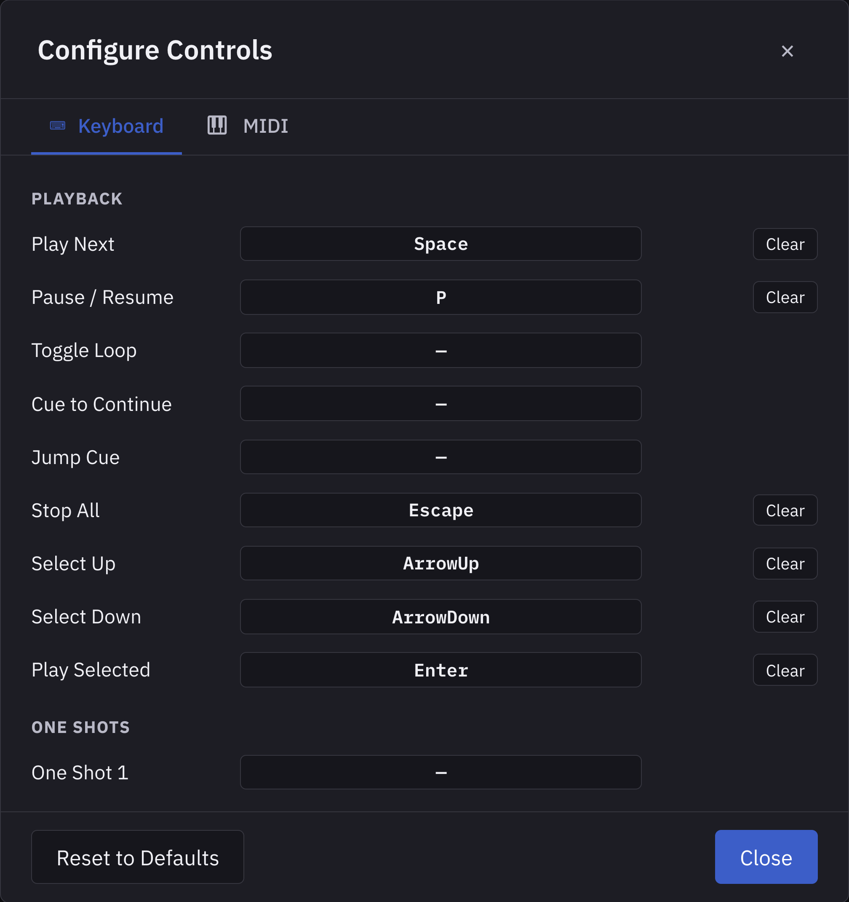

**Procedure — hand over a keyboard-controlled show**

- **Prerequisites:** Audio is stopped or protected and the outgoing operator can identify all non-default assignments.
- **Actions:** Open the Keyboard tab, compare GO, Stop All, Pause/Resume, Play Selected, loop actions, and One Shot keys with the handover sheet. Close the dialog, focus the workspace, and test only during rehearsal.
- **Expected visible outcome:** Each tested key invokes exactly the labelled action once.
- **Common mistake:** Testing Space or Escape while a text field or Video Output has focus and generalizing from that result.
- **Recovery:** Stop safely, close editors, restore workspace focus, check conflicts, and repeat the controlled test.

Playback assignments belong to the project. No One Shot has a default key. The baseline defaults are Space for Play Next, P for Pause/Resume, Escape for Stop All, Up/Down for selection, and Enter for Play Selected. Toggle Loop, Cue to Continue, and Jump Cue are initially unbound. F1 is a separate Play Selected audio action, not a help key in this app.

Text fields normally own typing, so a playback letter does not fire while you are editing a name. Close editors and dialogs before the next cue call. Keyboard/MIDI Pause/Resume and Toggle Loop target the first active cue, otherwise the selected audio cue; use the specific cue's visible control if several cues are active and you need certainty about the target.

> **SAFETY — Pause/Resume can start audio.** With no active cue, keyboard or MIDI Pause/Resume starts the selected audio cue if it is inactive. It is not a universal silence command. Mapped Toggle Loop also edits authored project behavior, subject to Autosave/Save; use Cue to Continue for a runtime-only loop release.

### Map a MIDI controller

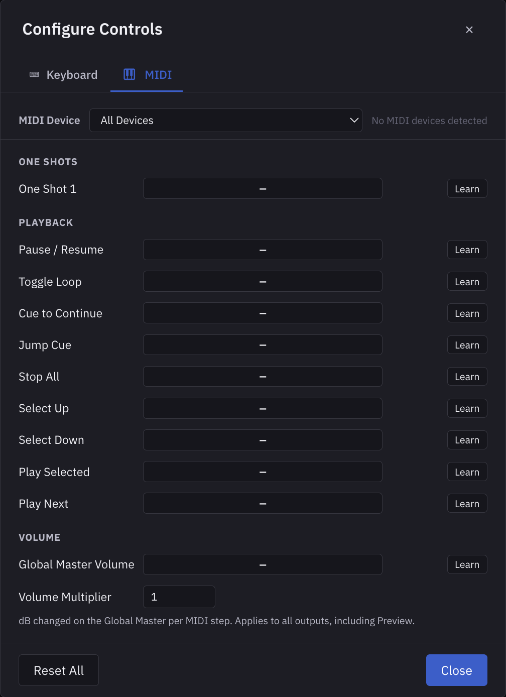

1. Connect the controller before the show and open the shortcut/control configuration's **MIDI** tab.
2. Select the intended **MIDI Device**. **All Devices** listens broadly; choosing a particular controller reduces accidental input from other connected equipment.
3. Choose **Learn** beside the required action and operate the intended pad, button, or fader once.
4. Check the captured channel and message, resolve any **Reassign** conflict, and leave Learn mode.
5. In a safe rehearsal, test exactly one intended action, including arming and retrigger policy for One Shots.
6. Repeat on the backup computer. MIDI mappings are machine settings, not part of the project document.

There are no default MIDI mappings. Supported inputs include Note, CC, and Pitchbend. A Note On must have nonzero velocity; discrete CC/Pitchbend activation uses values above the midpoint. Note Off does not stop a cue. Do not assume a held pad means “play while held.”

**Master Volume uses directional steps, not an absolute fader position.** The first received MIDI value establishes a reference; subsequent movement nudges the engine's separate Master Volume state up or down by the configured multiplier. It does not move the visible main Master output fader or the other output faders. Use a conservative multiplier and verify the result through the rehearsed meter/listening path. Controls are ignored while disconnected, although Learn can still capture a mapping. This is application routing behavior, not a claim that physical MIDI hardware was certified by this source review.

### External triggering

Cue Basic Info displays **API Trigger URL · POST** with a copy control. An external controller must send the indicated method and authenticate; simply opening the URL in a browser is not equivalent. Have the system administrator configure and test the integration before the show. This source supports authenticated HTTP/WebSocket control, not a built-in OSC listener. Do not create an OSC show plan based on a future-feature description.

## 9. Video Output

### Choose the picture computer and display

Video Output belongs to the desktop client, not to the headless engine. The recommended arrangement keeps the audio engine and video-rendering desktop on the same machine. If you use a remote engine, the picture still appears on the desktop client's display/HDMI and the media is streamed over the network; include that network in rehearsal and failure planning.

Use **Video Output** in the toolbar or **Settings → Video Output**. Assign the intended display and verify its identity against the physical projector, switcher, or monitor. The app remembers the display assignment on that computer, but the output window starts closed on every application launch. Open and check it for each session.

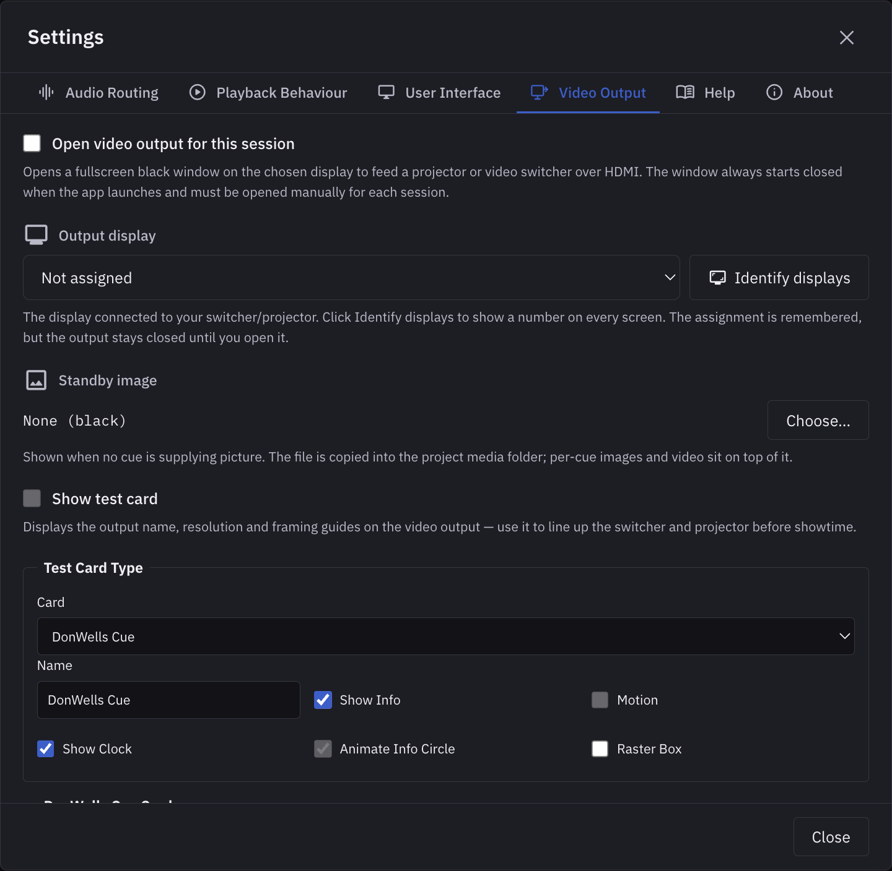

**Procedure — open and identify the audience output**

- **Prerequisites:** Operator and audience displays are extended rather than mirrored, the switcher/projector operator is ready, and no private desktop content is exposed.
- **Actions:** Open **Settings → Video Output**, choose **Identify displays**, match the number at the physical destination, select that **Output display**, and enable **Open video output for this session**. Read **Output status**.
- **Expected visible outcome:** The output reports live on the intended display and the destination operator confirms the same image.
- **Common mistake:** Treating the single-display preview window as the assigned fullscreen output.
- **Recovery:** Disable the session output, correct mirroring/cabling/assignment, identify again, then reopen and verify at the physical destination.

With only one display or no dedicated assignment, the app uses a normal preview window rather than automatically taking over the control screen fullscreen. Do not mistake a preview window for a correctly assigned projector output. Use an extended desktop, not operating-system display mirroring, when you need separate operator and audience surfaces.

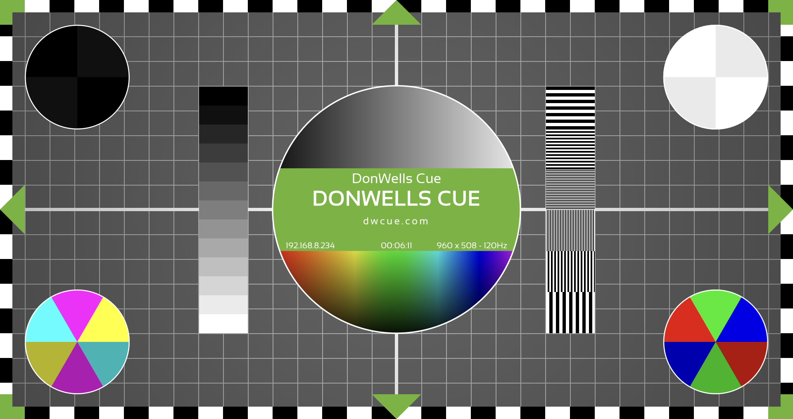

**Procedure — line up picture and optional AV Sync**

- **Prerequisites:** The audience feed is safe to show a test pattern and, for AV Sync, the selected DonWells Cue Program output may safely carry the native tone.
- **Actions:** Choose **Show test card**, confirm identity/resolution/framing at the destination, and adjust the venue video chain. If the production needs it, select **AV Sync** and the intended Audio Device, run the tone only with audio staff ready, then switch the card off.
- **Expected visible outcome:** The physical destination shows the labelled card within the expected bounds; AV Sync is visible and audible only through the intended Program path.
- **Common mistake:** Assuming AV Sync is silent or routed to Preview.
- **Recovery:** Press **Stop All** to stop the tone, switch the card off and on only when a restart is intended, then correct the selected Audio Device before retesting.

### What the audience sees

The output shows one picture at a time. A newer sounding cue takes over the picture; this is a cut, not a layered video mix or a guaranteed dissolve. Video is contained in the output area with letterboxing rather than cropped. The background is opaque black.

When a cue has no usable video, the output can use its **Cue image**, then the configured standby image, then black. Set a Cue image in the cue's Basic Info and configure standby behavior in Video Output settings. Preview/headphone playback does not take over the output. The picture player's audio is muted so that the audio engine remains authoritative.

Use H.264 or HEVC media for this source edition. ProRes and other production codecs are not supported by the documented video path. Container extension alone is not a codec guarantee. Test every video on the exact show machine, including its soundtrack, opening frame, end behavior, aspect ratio, and transitions between audio-only and video cues.

> **CAUTION — A fallback can hide a video failure.** If video cannot load or decode, the output can fall through to a cue image, standby image, or black without a blocking show alert. A healthy audio cue does not prove the picture is playing. Watch the actual destination during rehearsal.

### Fullscreen, keyboard focus, and blackout

Double-click or use the output window's context controls to change fullscreen. If the assigned display disappears, the app closes that output instead of moving it onto the control display; it can reacquire the assignment when the display returns while the session remains enabled. Recheck the physical output after reconnecting a cable.

Eligible playback keys from the focused Video Output are forwarded to the controller. **Escape exits output fullscreen and, with the default shortcut mapping, also invokes Stop All.** If Stop All is remapped, Escape still exits fullscreen. Rehearse this distinction before giving the output window focus during a show.

There is no dedicated video-blackout button or shortcut in this source. **Stop All is not a separate picture-blackout command**: a configured standby image can remain visible after cues stop. If the show needs a guaranteed independent blackout, prepare and rehearse it on the video switcher/projector or another supported part of the venue system. Closing Video Output can expose the desktop and is not an audience-safe blackout procedure.

## 10. Connect to a remote audio server

### Prepare the server deliberately

Use remote mode only when the audio computer is separate. The operator needs its address, control port, access token, and authorized restart contact.

For a trusted-LAN setup, an administrator can start the installed standalone server with:

~~~text
dwcue-server --bind 0.0.0.0
~~~

Binding to 0.0.0.0 exposes control to network interfaces, unlike the local-only default. Every bind requires a token. An empty LIVEPLAY_ACCESS_TOKEN generates one once at startup; a supplied token needs at least 16 characters or startup fails. Keep it private.

| Default port | Purpose |
| --- | --- |
| TCP 4480 | Project/control requests, WebSocket transport/state, and media delivery. |
| UDP 4481 | Best-effort LAN discovery; a server can still be reached by address when discovery is unavailable. |

Allow only the intended trusted-network access. The app does not open firewall rules. Plain HTTP/WebSocket plus a bearer token is not safe for the public internet; do not forward these ports, and use an administrator-approved secure arrangement across untrusted networks.

### Connect the controller

1. On the welcome screen choose **Change**, then reveal **Connect to a server on the network…** if needed.
2. Choose **Remote**. Select a discovered server or enter the **Server Address** supplied by the administrator.
3. Enter its **Access token**, then choose **Connect**.
4. Confirm the server identity and project name. A server with a project already open can bring you into that existing session.
5. Check audio readiness and physical output before firing; a health probe does not prove authenticated control works.

**Expected result:** The workspace names the intended server project and accepts an authenticated, non-audible control check. **Common mistake:** entering `127.0.0.1` on the controller for a different audio computer. **Recovery:** return to Server Settings, use the audio computer's approved LAN address and current token, and reconnect without restarting an engine that another operator may be using.

Discovery may fail across subnets, VPNs, or restricted Wi-Fi; use the explicit address rather than treating an empty list as proof the engine is down. For a remote engine, localhost/127.0.0.1 points to the controller and is the wrong address.

### Credentials and shared control

The managed local desktop supplies its session credential automatically; do not copy it into a browser, show document, or authentication workaround. A managed restart refreshes it. External integrations need the current token too.

A browser integration's exact origin must be authorized; another localhost spelling or port is not implicitly trusted. Do not add a broad origin exception during a show.

A remote server is shared state. Another operator can close, replace, or edit its project, so agree who owns show control, changes, and restarts. Dirty local edits require the recovery choice described in chapter 11 rather than being silently replaced.

## 11. Save, back up, recover, and quit

### Know what is saved

<!-- diagram:save-recovery -->

The save-recovery chart separates an Autosave toggle's forced save from later off-mode edits, then shows the read-only hydration Retry path after an accepted native load. It is a decision map, not evidence that any disk write, backup, archive, or recovery request has succeeded.

**Autosave** is on by default. Changing the toggle in either direction force-saves the current document together with the preference. Do not use the toggle merely to experiment with an unsaved show. After Autosave is off, subsequent edits change the active engine document and remain dirty until an explicit save; after it is on, subsequent accepted edits request persistence. It is not an audio safety lock. Use **File → Save Project** for a deliberate durable checkpoint. New and converted shows save to their canonical `.dwcue` path.

A failed toggle-save or ordinary save retains the dirty state. Enabling Autosave can hide the header's unsaved badge even when that forced save failed, because the badge appears only while Autosave is off and the document is dirty. Verify the save result and known-good disk copy rather than relying on the badge alone. A detached One Shot save failure is reported in the loaded detached panel and its error popover, not as the general presentation for every primary-window save failure. Correct the path, permissions, or storage fault before retrying.

**Procedure — recover from a save refusal without losing the show**

- **Prerequisites:** Keep the current client and project open; do not toggle Autosave again merely to clear an indicator.
- **Actions:** Read and record the exact refusal. Check destination availability, permissions, free space, and whether the expected volume is mounted. Correct the fault, use **File → Save Project**, then verify the intended canonical file and make a separate copy.
- **Expected visible outcome:** Save succeeds for the current document and destination; subsequent intended edits follow the current Autosave preference.
- **Common mistake:** Enabling Autosave, seeing the header badge disappear, and concluding that the forced save succeeded.
- **Recovery:** Treat the document as dirty until a positive save succeeds. If it cannot, preserve the running session and use an authorized writable destination/export path without overwriting a known-good show.

Saving is serialized: each save captures one consistent document and destination, publishes through a unique sibling temporary file, and leaves newer pending edits dirty until their own save succeeds. A failed Save As does not change the project's identity or path. A late response from an older project, detached window, or older edit cannot clear or mutate the current project. Closing a project clears its identity and destination path; a blank welcome screen is not an invitation to overwrite the previous show. A converted legacy show never uses the selected `.liveplay` source as its save target.

The server makes background copies of the existing disk project every 10 minutes into a **backups** folder beside it, retaining at most 20. Those are project-file backups, not full media packages, and they cannot capture unsaved edits that never reached disk. Keep a separate known-good full-show copy as well.

### Export a portable show

1. Stop the rehearsal at a known point and save the intended project changes.
2. Use **File → Export Project…**. Export performs a forced save before packaging; resolve any save failure rather than continuing with an assumed current archive.
3. Choose the destination. With a remote server, **Save on Server** writes there and **Download Here** brings the archive to the controller.
4. Keep the resulting **.dwcuepack** archive with its version/date clearly identified.
5. Import it into a separate rehearsal location and verify cues, media readiness, images, and playback with the original source paths unavailable.

> **CAUTION — Export packages the project folder.** Keep the show in a dedicated folder. Do not choose a folder containing credentials, unrelated documents, personal media, or application data and assume export will include only the files shown in the playlist. Externally linked media also needs a deliberate portability check.

Device assignments, physical patching, local MIDI mappings, and video display identity need checking on the destination machine. A successful archive extraction is not a substitute for that check.

### Import a show or archive and inspect repairs

Use **File → Import Project…** for a portable `.dwcuepack`, an older `.liveplay` show, or an older `.lpa` archive. A native `.dwcuepack` or legacy `.lpa` archive must contain exactly one root project; an archive with none or more than one is refused. A direct `.liveplay` import creates an available `.dwcue` sibling beside the source and loads that canonical result. It does not overwrite the legacy document.

For an archive, the app infers native or legacy handling from the `.dwcuepack` or `.lpa` filename. In remote operation, choose **Browse Server** for a server-resident archive or **From This Computer** to upload it, then select a fresh extraction directory on the audio-server computer. A successful import returns and opens one canonical `.dwcue`. If an older server response exposes multiple candidate results, choosing among them is a compatibility-only branch; it does not relax the rule that a native archive itself must contain exactly one root project. A legacy archive's original bytes remain unchanged and its staged `.liveplay` is not published in the destination.

Extraction refuses unsafe entries and destination collisions rather than silently overwriting an existing show. If import reports a collision, choose a clean destination; do not delete the working show just to force an import. Wait for import and audio readiness, then listen to representative cues and inspect the important transitions.

On loading a document that needs supported structural repairs, **Corrupt Project Detected** can appear. **Repair & Save** writes the repaired canonical document. **Open Without Saving** opens the already repaired in-memory document but leaves its canonical disk file unchanged until a later save. It does not recover missing media or guarantee that every damaged project is repairable. Legacy source bytes remain untouched by either choice. Preserve the source, then inspect the cue count, groups, One Shots, and jump targets.

When a project path is accepted but the page/header load cannot finish, the app enters an explicit read-only load-error state rather than exposing a partly hydrated editable document. **Stop All Cues** and its configured Escape shortcut remain available. Choose **Retry** after correcting the connection or storage fault. After native acceptance, Retry fetches the engine's current project header and pages; it never silently reopens the old file path. If the initial open itself was never accepted, Retry can retry that originally requested path. Confirm the loaded show name and cue readiness before editing or pressing GO.

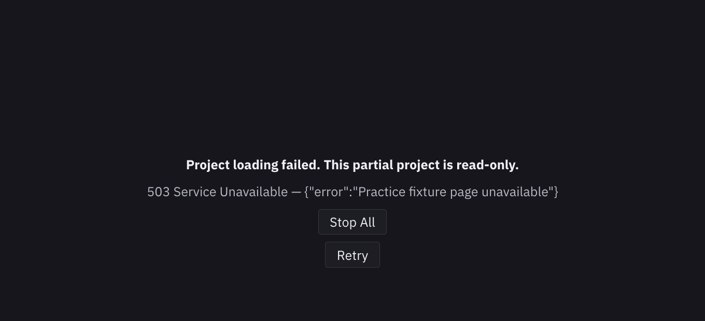

**Procedure — retry a failed project load safely**

- **Prerequisites:** Protect the audience first and establish whether the server accepted the open request.
- **Actions:** Do not edit the failed view. Use **Stop All Cues** or its configured Escape shortcut if the operating plan requires it. Correct the connection/storage cause, choose **Retry**, then read the returned show name and cue pages.
- **Expected visible outcome:** The app leaves the failed view only after a complete current header/page hydration.
- **Common mistake:** Assuming Retry always reopens the originally chosen file.
- **Recovery:** If native acceptance already occurred, treat the server's current header/pages as authoritative and verify identity before GO. If the original open was never accepted, Retry may request that original path again.

### Connection loss is not proof that sound stopped

The **Connection lost** overlay blocks normal playback/edit input while reconnection is attempted. **Retry now** retries the same server. Its **Restart** action relaunches the client only; the audio engine and Program can continue running. **Exit** closes the client. Before restart or exit, the desktop removes client-owned AV resources. If that cleanup fails, the diagnostic remains visible and the action is refused rather than abandoning an owned resource; correct the cause and retry. Correct a wrong address or credential through Server Settings rather than repeatedly retrying the wrong destination.

After the managed engine actually restarts, the controller can present the different **Server restarted** prompt shown below; do not confuse it with the Connection lost overlay's Retry, Restart-client, and Exit actions.

**Procedure — respond to connection loss during a show**

- **Prerequisites:** The team has an independent console-silence procedure and a named person authorized to restart the engine.
- **Actions:** Tell the caller/control team that controller state is unknown. Listen and check the physical destination without firing controls blindly. If the same endpoint remains correct, choose **Retry now** once. Use **Restart** only to relaunch the client; use Server Settings for a wrong endpoint. If **Server restarted** appears, establish project authority before choosing **Continue session** or **Start fresh**.
- **Expected visible outcome:** The same project and current live state rehydrate before normal input is exposed, or an explicit recovery choice remains visible instead of a partly trusted workspace.
- **Common mistake:** Treating **Restart** as an engine stop, or choosing **Exit** to silence Program.
- **Recovery:** Control sound through the agreed independent path, coordinate with the server operator, then verify project identity, active cues, devices, arming, and save state before the next GO.

When a network controller loses contact, do not assume the audience has silence. The remote engine may still be playing. Use the venue's agreed communication and independent output-control procedure. Avoid restarting an engine that another operator is actively using.

### Choose the correct recovery direction

<!-- diagram:recovery -->

| Prompt / choice | What you are authorizing |
| --- | --- |
| Server restarted → Continue session | Reload the previous project and restore available local in-memory edits. Restored unsaved edits remain dirty; this is not a disk save. |
| Server restarted → Start fresh | Immediately discard the client-held document and return to Welcome, without an unsaved-changes prompt. If edits matter, choose Continue session first, then save or export them before leaving the session. |
| Server project changed → Use server project | Adopt the server document and discard local unsaved edits. |
| Server project changed → Restore local project | Replace the server's active document with the local document. This affects the shared session and remains unsaved until you save it. |

A matching path does not prove that two documents have the same edits. The current source asks for a decision when local edits are dirty and a server project is present, including changes to the same path. A clean controller follows the server's authoritative project without needing this conflict decision.

Before **Restore local project**, coordinate with the operator controlling the server. Before **Use server project**, decide whether you need to preserve the local edits. Neither button is a merge tool. After either recovery path, verify cue readiness, output devices, arming, active playback, and the actual saved state before the next GO.

### Engine crash recovery is best-effort

A fatal engine crash can trigger an automatic restart after about 5 seconds. Its roughly 2-second recovery heartbeat records the project and at most one playing/fading-in cue with a position. It is not an exact reconstruction of a live mix: paused cues, multiple simultaneous cues, and runtime Cue to Continue are not preserved as a complete scene.

Expect a possible position rollback and recheck the result before taking control. Playback may resume from recovery state, so coordinate the console response instead of assuming a crashed engine will remain silent. Repeated failures eventually disable automatic restart after five consecutive crashes. Preserve logs and diagnose the fault rather than repeatedly relaunching during a show.

### Quit the intended part of the system

For unsaved edits, ordinary New/Open/Close actions offer **Save**, **Don't Save**, or **Cancel**. Cancel is a single native cancellation path. If Save fails, the current show and selection remain in place and the requested open/close is cancelled; a successful Save writes the old show before the new one opens. Quit uses **Return to Project**, **Close and disregard changes**, or **Save project, then close**. A failed save cancels the requested close action.

**Procedure — clear the unsaved-project quit guard**

- **Prerequisites:** Identify whether the current edits belong in the durable show and confirm that no second operator is making a competing save.
- **Actions:** Invoke Quit, read the show name, then choose **Return to Project**, **Close and disregard changes**, or **Save project, then close** according to the agreed disposition of the edits.
- **Expected visible outcome:** Return keeps the project open; disregard advances toward closing without saving those edits; a successful save writes them before the close sequence continues.
- **Common mistake:** Treating **Save project, then close** as successful before the save result is known.
- **Recovery:** If save fails, remain with the project and selection intact, correct the storage fault, verify a deliberate save, then request Quit again.

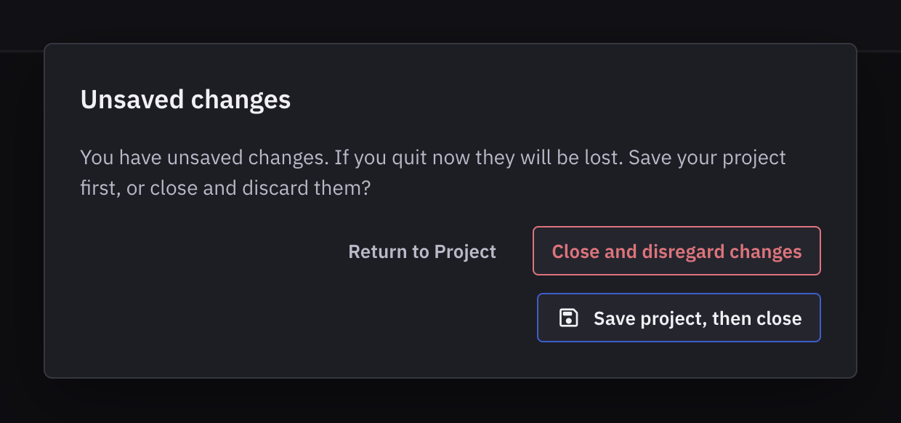

If the managed local engine is running, the next choice distinguishes **Close Client Only** from **Close Server**. **Close Client Only removes client-owned Preview/test-tone resources but leaves the Program mix and engine running. Close Server stops playback and disconnects every connected client.** A failed AV cleanup retains the owned-resource diagnostic and refuses the terminal action. Closing a controller connected to a remote engine does not shut down that remote engine.

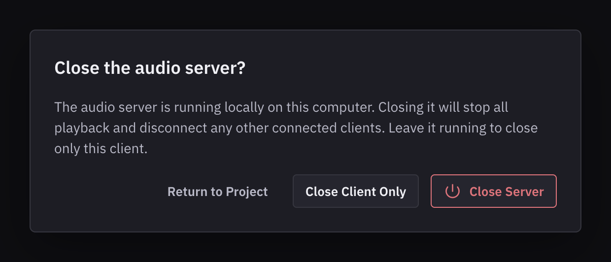

**Procedure — end an operating session**

- **Prerequisites:** The caller and every connected operator agree the show is finished; intended edits have a confirmed save; live cues, Preview, and test tone are identified.
- **Actions:** Stop Program when required, verify the physical outputs, invoke Quit, and read the presented choices. Choose **Close Client Only** only when the engine/Program must remain; choose **Close Server** only when stopping playback and disconnecting all clients is authorized.
- **Expected visible outcome:** The selected component closes only after client-owned AV cleanup succeeds.
- **Common mistake:** Using **Close Client Only** as an emergency silence command.
- **Recovery:** If cleanup fails, do not force past the retained diagnostic. Correct the owned Preview/test-tone resource, retry the intended action, and control Program through the explicit transport/console path.

At pack-down, explicitly stop live cues and previews, verify the physical outputs, save the intended changes, and select the appropriate shutdown action. Closing a window is not the same operation as stopping the show.

## 12. Troubleshooting at the operator position

### Use a short, ordered diagnosis

First protect the audience using the rehearsed stop/mute procedure. Then identify whether the failure is connection, transport, media, output, or picture. Change one thing at a time and record the result. Avoid repeated GO or Restart commands while the actual playback state is unknown.

**Procedure — diagnose “time moves but no sound”**

- **Prerequisites:** Protect the audience and stop unrelated cues. Ask the console operator to hold the known patch and report observations.
- **Actions:** Confirm the file has audio and the cue region contains it; inspect cue Volume and output override; inspect project Audio Device, the visible main Master output fader, the relevant output meter, and limiter; then trace interface channel, cable, console input/mute, and destination.
- **Expected visible outcome:** The last stage showing expected activity narrows the fault to the next stage, and an actual destination listen confirms restoration.
- **Common mistake:** Changing several gains, routes, and cables at once, destroying the evidence and possibly creating a second fault.
- **Recovery:** Return changed controls to recorded show values, resume the ordered trace, and substitute only one known-good element at a time.

| Symptom | Check in this order |
| --- | --- |
| GO does nothing; target stays armed | Read the displayed refusal, then check connection, media readiness/errors, and the acknowledged target before one deliberate retry. An unready decoder does not block Stop All/Panic, and a rejected start preserves the armed target. |
| Cue time moves but there is no sound | Media contains sound; In/Out and cue level; device override; Main device and level; physical console patch, mute, and loudspeaker path. In remote mode check the engine computer's device. |
| A sting stops the bed | Check Playback Replace Program or cue Ducking Stop All Other Cues. Use Overlay/No Ducking or a rehearsed Duck Program setting when the bed must continue. |
| Preview is heard in the house | Stop Preview and verify the actual Preview Device and physical patch. Sharing Main's physical output is not private monitoring. |
| A loop never advances | Check the saved Loop setting and whether Cue to Continue was armed for this playback instance. A stop/replay cancels the previous continuation. |
| A group does not leave its last cue | Check the group's End Behavior and destination, then confirm that the selected descendant run completed rather than being manually stopped or cancelled. Stale child completion cannot fire the group ending after cancellation. |
| One Shot does not fire | Show Mode arming, current keyboard/MIDI mapping, retrigger Ignore, connection, and media readiness. Note Off is not a stop command. |
| MIDI volume appears to move the wrong stage | Confirm the mapping is Master Volume and make one small directional movement after its reference value. It changes separate engine state and does not move the visible main Master output fader or other output faders; verify the audible result only through the rehearsed destination. |
| Video is black or shows a still image | Confirm Video Output is open, the correct display is assigned, the cue has supported video, and the actual decoder is playing. Fallback images can hide a media failure. |
| The server appears in discovery but will not connect | UDP discovery does not prove TCP reachability or authentication. Verify address, control port, firewall, and current token. |
| Changes are missing after a restart | Check which copy was opened, whether the last save succeeded, Autosave state, and available disk backups. Unsaved edits are not in a disk-only backup. |
| A moved show reports missing media | Restore the whole project folder, check external linked paths and mounted volumes, or replace the missing file in cue Properties and recheck its trims. |

### Level Check is audible program playback

**Level Check** is a soundcheck tool, not a silent analysis report or headphone preview. It chooses an approximately 5-second window near a cue's loudest available waveform peak and plays it through the normal program transport. Cues with no usable waveform or a fully silent region may be absent from the check.

Entering the mode does not immediately play the first cue. Use its replay/play control, then Previous/Next to move through eligible cues. Previous and Next start playback automatically. While the bar is active, **R** replays, **[** goes to the previous cue, **]** to the next cue, and **Q** exits. These keys do not take over text fields; the normal Space/Stop All pathways remain available.

Perform this only during soundcheck with the console operator ready. Normal cue routing, ducking, and sequencing still matter; it is not an isolated substitute for rehearsing a show. Exit and verify that soundcheck playback has stopped before opening the house.

### Collect useful evidence

Record the exact app build/source edition, operating system, engine computer, local/remote mode, device name, cue name, visible state, and the sequence of actions that caused the problem. Include whether the playhead and meters moved and whether sound/picture was checked at the destination.

There is no general packaged Diagnostics window in this source. Use connection status, Server Settings, device selection, and the persistent server logs. **Restart engine** affects actual playback; obtain the show operator's agreement before using it.

For upgrade compatibility, the managed desktop engine intentionally continues to use the legacy-named **LivePlay** data directory; the app does not copy, move, or rename that profile at startup. On macOS, its engine log is normally **~/Library/Application Support/LivePlay/logs/dwcue-server.log**. Fatal reports are under its **crash-logs** folder. The normal log rotates to **dwcue-server.log.1** at about 10 MiB. Standalone-server state is separate: on macOS it defaults to **~/Library/Application Support/DonWells Cue/server**, on Windows to **%LOCALAPPDATA%\DonWells Cue\server**, and on Linux to **$XDG_STATE_HOME/dwcue** or **~/.local/state/dwcue**.

Provide a minimal reproducible show or media sample only if you have permission to share it. Remove tokens, personal paths, private media, and unrelated application data from reports. A device's logged negotiated sample rate is better evidence than assuming the API's reported requested/default rate is the physical driver's actual rate.

Report actionable issues through the [project issue tracker](https://github.com/donwellsav/dwcue/issues). Preserve the log around the failure before repeated restarts overwrite or rotate useful evidence.

## 13. Printable show-day checklists

### Before doors

- [ ] Correct app build and correct named show loaded on the performance computer.
- [ ] Known-good full-show backup exists and has been opened successfully elsewhere.
- [ ] All required media is ready; missing-file and decoder errors resolved.
- [ ] Main device, per-cue overrides, console patch, and actual sound checked.
- [ ] Preview reaches only the intended headphones/monitor path.
- [ ] If using LTC, its destination is isolated from the audience path; start time, frame rate, and receiver lock tested.
- [ ] Cue gains, overlap/ducking behavior, limiter, and transitions rehearsed.
- [ ] Loop continuation, Jump Cue, and the configured Stop All fade rehearsed.
- [ ] Group exits use explicit, checked targets where needed.
- [ ] Correct GO target is visible; shortcuts checked against this project.
- [ ] Required One Shots armed; retrigger and auto-disarm policy checked.
- [ ] MIDI mappings checked on this machine; unused controllers disconnected or filtered.
- [ ] Video Output opened, display verified, and first frame/standby/fallback checked.
- [ ] Independent audio emergency-silence and video-blackout procedures agreed.
- [ ] Mains power, sleep policy, notifications, cables, and spare media ready.
- [ ] Network/server ownership, credentials, and recovery decision-maker agreed.
- [ ] Intended changes saved; no unresolved Unsaved Changes or recovery prompt.

### At an interval or operator handover

- [ ] Active cues and any interval material identified explicitly.
- [ ] Next called cue and the displayed Play Next target agree.
- [ ] Armed One Shots and non-default shortcut mappings communicated.
- [ ] Current Autosave/dirty state and last known-good save identified.
- [ ] Output, network, or video issues communicated rather than silently worked around.
- [ ] Incoming operator knows whether closing this client leaves the engine running.

### After the show

- [ ] Live cues and Preview stopped; physical outputs checked.
- [ ] Video output and standby handled according to the venue's pack-down plan.
- [ ] Intended edits saved and a dated archive/backup made where required.
- [ ] Any incident notes and relevant logs preserved without exposing credentials.
- [ ] Appropriate Close Client Only / Close Server choice made.
- [ ] Engine shutdown coordinated with every other connected operator.
- [ ] Hardware disconnected only after the agreed shutdown sequence.

### Handover record

| Record | Fill in before the performance |
| --- | --- |
| Show / revision / date | `____________________________________` |
| App build / source edition | `____________________________________` |
| Engine computer / address | `____________________________________` |
| Main / Preview / LTC devices | `____________________________________` |
| Video display / standby plan | `____________________________________` |
| First GO target / first armed One Shots | `____________________________________` |
| Stop All fade / independent mute procedure | `____________________________________` |
| Save / archive location | `____________________________________` |
| Responsible operator / recovery contact | `____________________________________` |

Do not write the access token on a publicly visible handover sheet. Store credentials using the venue's approved private method.

## 14. Quick reference and edition notes

### Default controls

These are source defaults, not a promise about a project's customized assignments. Check the actual Shortcut settings. Playback keys normally yield while you type in an input field.

| Control | Default action |
| --- | --- |
| Space | Play Next / GO |
| P | Pause/Resume the first active cue; with none active, starts the selected audio if inactive |
| Escape | Stop All Cues using the configured global fade |
| Up / Down arrows | Move playlist selection |
| Enter | Play Selected audio |
| F1 | Separate Play Selected audio action |
| Toggle Loop | No default binding. If assigned, sets End Behavior to Loop or Nothing: a project edit, not a one-pass release |
| Cue to Continue / Jump Cue | No default binding; use the appropriate live control or assign deliberately |
| One Shot keys | No default binding |
| Cmd/Ctrl+S | Save Project |
| Cmd/Ctrl+O | Open Project |
| Cmd/Ctrl+N | New Project |
| Cmd/Ctrl+W | Close Project |
| Cmd/Ctrl+Q | Exit / quit workflow |
| F11 | Fullscreen |

With Video Output focused, Escape also exits its fullscreen mode. In Level Check, R / [ / ] / Q have the temporary meanings described in chapter 12. MIDI bindings belong to the machine; keyboard playback assignments belong to the project.

### Current-source boundaries

- Group Play First / Play All preflights and owns the selected descendant run; a refusal starts no children, and an accepted group's End Behavior runs exactly once on normal completion.
- Audio Start Behavior Play Next / Play Item / Play Index and timed Start Next actions execute through the engine; cycles and overlapping structural starts still require rehearsal.
- One Shot Duck Time and Release Time author the runtime envelope. Overlapping owners use the strongest absolute ceiling and restore against surviving owners and current base gains.
- The advanced routing API exists, but its matrix component is not mounted as an operator-accessible screen.
- There is no built-in OSC listener, dedicated video-blackout command, or general packaged Diagnostics window.
- Video uses one picture at a time. H.264/HEVC capability and display/focus behavior must be checked on the performance hardware; source-level support is not a certification of every computer or codec profile.
- Engine crash recovery is best-effort, not a redundant playback system or complete live-state snapshot.

### About this edition

This manual documents package version **2.6.14** as exercised at source revision **8ea1e9c6ee02414301947f210b35b4952aa5d254**, with native engine baseline **7a0eee21688e378e99a78b50c0c4ec414435bb65**. It does not claim that a published installer contains these changes. All interface screenshots were newly captured from the verified current package using disposable show data and purpose-made test fixtures; engine output was silenced using owned test-gain settings, with the per-image method recorded in **docs/manual-assets/captures.json**. They contain no access tokens or private projects. No screenshot certifies audience audio, physical routing, projector behavior, network performance, or external MIDI hardware.

The preparation and recovery instructions were checked against the Vue/Electron interface and C++ control engine. Fresh overview images establish orientation; fresh detail images keep the named controls readable at manual size. They are documentation evidence, not certification of a published installer or every platform. Source verification does not replace rehearsal of conversion, acoustic levels, physical routing, external LTC lock, physical MIDI hardware, network performance, focus behavior, or projector/display hot-plug handling.

**Photo credits**

- **audio-connector-photo.jpg:** Musicproducer, “Professional sound card fireface uc back side with connectors,” Wikimedia Commons, [source](https://commons.wikimedia.org/wiki/File:Professional_sound_card_fireface_uc_back_side_with_connectors.jpg), [CC BY-SA 4.0](https://creativecommons.org/licenses/by-sa/4.0/).
- **stage-operator-photo.jpg:** unknown author via Pxhere, “Behringer X32 Digital Mixer in operation - angled,” Wikimedia Commons, [source](https://commons.wikimedia.org/wiki/File:Behringer_X32_Digital_Mixer_in_operation_-_angled_(2017-07-21_17.23.52_@pxhere_174508).jpg), [CC0 1.0](https://creativecommons.org/publicdomain/zero/1.0/).

For technical maintainers, the principal source areas are **client/app/components**, **client/app/composables/useProject.ts**, **useAudioEngine.ts**, **useLiveplayServer.ts**, **useConnectionGuard.ts**, **useLevelCheck.ts**, **client/electron/main.js**, **server/src/core/project_state.cpp**, and **server/src/net/control_server.cpp**. The repository's root, client, and server READMEs are developer references; historical design documents are not operator promises.

The editable manual is **docs/operators-manual.md**. Its PDF is generated by **scripts/generate-operators-manual.py**, with screenshot provenance in **docs/manual-assets/captures.json**. Update the source and regenerate the PDF together after an operator-visible change.

### Useful links

- [DonWells Cue project and source](https://github.com/donwellsav/dwcue)
- [Published releases and installer notes](https://github.com/donwellsav/dwcue/releases)
- [Issue tracker](https://github.com/donwellsav/dwcue/issues)
- [Project website](https://dwcue.com)

Return to [the operating rules](#1-read-this-before-the-show), [the GO procedure](#7-run-the-show), [recovery decisions](#11-save-back-up-recover-and-quit), or [the printable checklists](#13-printable-show-day-checklists) when using the PDF at the operator position.

